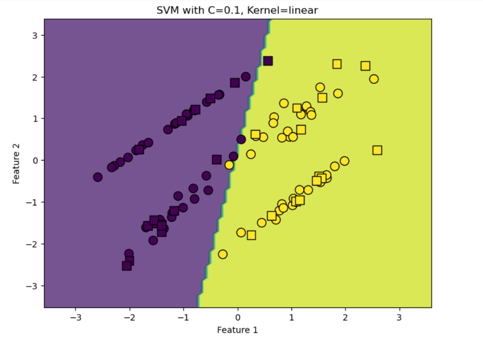
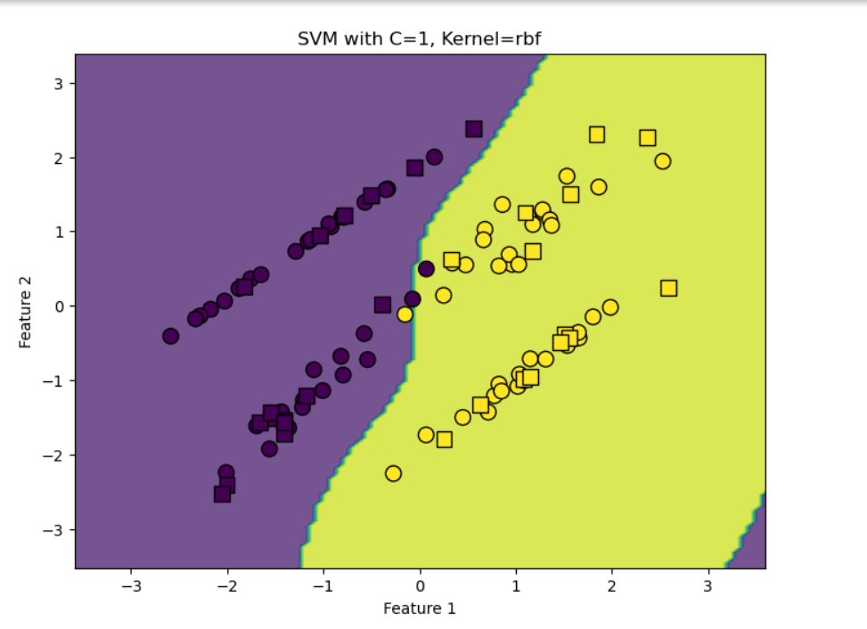
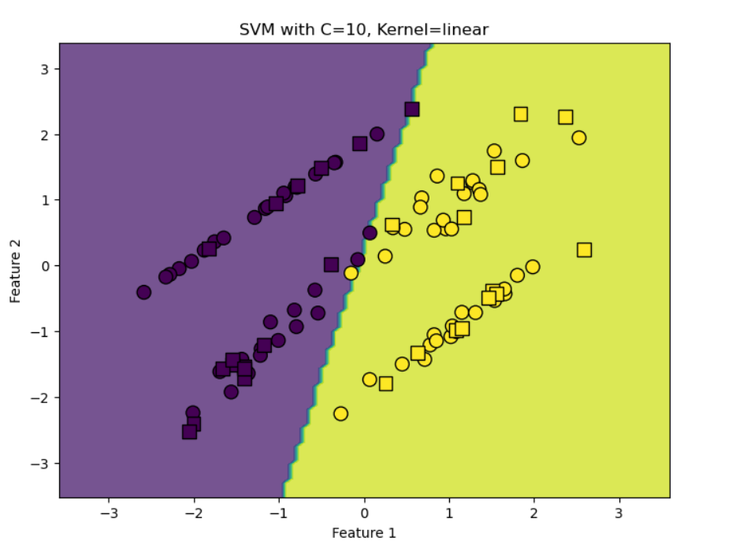
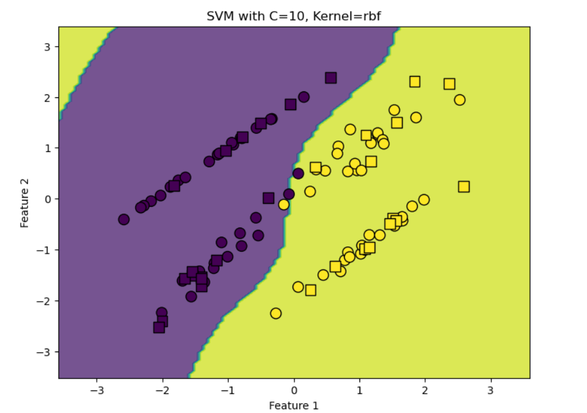

# BLENDED LEARNING
# EX-7 Implementation of Support Vector Machine for Classifying Food Choices for Diabetic Patients

## AIM:
To implement a Support Vector Machine (SVM) model to classify food items and optimize hyperparameters for better accuracy.

## Equipments Required:
1. Hardware – PCs
2. Anaconda – Python 3.7 Installation / Jupyter notebook

## Algorithm
1. Import Libraries: Import necessary libraries such as pandas, numpy, matplotlib, and sklearn.
2. Load Dataset: Load the dataset containing car prices and relevant features.
3. Data Preprocessing: Handle missing values and perform feature selection if necessary.
4. Split Data: Split the dataset into training and testing sets.
5. Train Model: Create a linear regression model and fit it to the training data.
6. Make Predictions: Use the model to make predictions on the test set.
7. Evaluate Model: Assess model performance using metrics like R² score, Mean Absolute Error (MAE), etc.
8. Check Assumptions: Plot residuals to check for homoscedasticity, normality, and linearity.
9. Output Results: Display the predictions and evaluation metrics.

## Program:
```
#Program to implement SVM for food classification for diabetic patients.
#Developed by: HARINI R
#RegisterNumber: 212223100010

import numpy as np
import matplotlib.pyplot as plt
from sklearn.svm import SVC
from sklearn.datasets import make_classification
from sklearn.model_selection import train_test_split

# Generate a simple classification dataset with the correct feature configuration
X, y = make_classification(n_samples=100, n_features=2, n_informative=2, n_redundant=0, n_repeated=0, n_classes=2, random_state=42)

# Split the data into training and testing sets
X_train, X_test, y_train, y_test = train_test_split(X, y, test_size=0.3, random_state=42)

# Try different C values and kernel types
C_values = [0.1, 1, 10]
kernels = ['linear', 'rbf']

for C in C_values:
    for kernel in kernels:
        model = SVC(C=C, kernel=kernel)
        model.fit(X_train, y_train)

        # Plot decision boundary and margins
        plt.figure(figsize=(8, 6))
        plt.title(f"SVM with C={C}, Kernel={kernel}")

        # Create grid to evaluate model
        xx, yy = np.meshgrid(np.linspace(X[:, 0].min()-1, X[:, 0].max()+1, 100),
                             np.linspace(X[:, 1].min()-1, X[:, 1].max()+1, 100))
        Z = model.predict(np.c_[xx.ravel(), yy.ravel()])
        Z = Z.reshape(xx.shape)

        # Plot decision boundary and margins
        plt.contourf(xx, yy, Z, alpha=0.75)
        plt.scatter(X_train[:, 0], X_train[:, 1], c=y_train, edgecolors='k', marker='o', s=100)
        plt.scatter(X_test[:, 0], X_test[:, 1], c=y_test, edgecolors='k', marker='s', s=100)
        plt.xlabel('Feature 1')
        plt.ylabel('Feature 2')
        plt.show()
```

## Output:










## Result:
Thus, the SVM model was successfully implemented to classify food items for diabetic patients, with hyperparameter tuning optimizing the model's performance.
